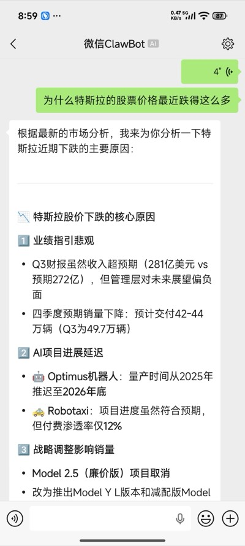

# Investment Agent

AI-powered local investment analysis tool with multi-engine agent architecture for comprehensive stock market analysis, portfolio management, and intelligent investment recommendations.

English Version | [中文版本](./doc/zh/README.md)

[](https://github.com/ishenli/investment-agent/releases/latest)
[](https://opensource.org/licenses/MIT)
[](https://github.com/ishenli/investment-agent/actions/workflows/ci.yml)
[](https://ishenli.github.io/investment-agent/)

## Product Prototype

### Electron Desktop


### WeChat



## Features

### Multi-Engine AI Architecture
- **DeepAgents Engine** - LangChain/LangGraph-based agent orchestration
- **Claude Engine** - Anthropic Claude Agent SDK integration  
- **Hermes Engine** - Lightweight agent framework with full observability (trace, metrics, cost tracking)
- Unified engine interface for seamless switching

### Multi-Channel Communication
- **WeChat Integration** - Personal WeChat account via iLink long-poll
- **Feishu Support** - Feishu bot integration (coming soon)
- **Web Interface** - Chat-based AI interaction
- Unified message router for multi-platform support

### AI-Powered Analysis Tools
- **Asset Information Query** - Real-time stock, fund, and gold prices via Finnhub
- **Investment Note Search** - Semantic search through investment notes
- **Database Query** - Natural language to SQL queries on portfolio data
- **Web Search** - Tavily-powered market research
- **Stock Analysis** - Technical indicators and market sentiment

### Agent Observability
- **Trace & Span System** - Hierarchical tracing for every agent execution with explicit context passing
- **Real-time Metrics** - Token usage, latency, tool call counts, and iteration stats
- **Cost Tracking** - Per-session cost breakdown based on model pricing tables
- **Live Observability Panel** - In-chat sidebar showing trace timeline, span details, and aggregated metrics
- **Persistent Storage** - Trace/span data saved to SQLite for historical analysis

### Investment Management
- **Portfolio Tracking** - Real-time position and P&L monitoring
- **Asset Management** - Multi-account support with performance analytics
- **Market Research** - Aggregated news and market information
- **Investment Notes** - Knowledge base with tag-based organization

### Modern Interface
- Clean dashboard with light/dark themes
- Real-time data visualization
- i18n support (English/Chinese)
- Desktop app (Electron) support

## Documentation

📚 **Full documentation**: https://ishenli.github.io/investment-agent/

## Quick Start

### Prerequisites
- Node.js 18+ 
- pnpm (recommended) or npm

### Installation

1. Clone and install:
```bash
git clone https://github.com/ishenli/investment-agent.git
cd investment-agent
pnpm install
```

2. Run development server:
```bash
pnpm dev
# Visit http://localhost:3000
```

### Global CLI (Optional)
```bash
npm install -g investment-agent
investment-agent [command]  # or: ig [command]
```

## Architecture

### Multi-Engine Agent System
```
┌─────────────────────────────────────────────┐
│           Unified Engine Interface           │
├──────────────┬──────────────┬───────────────┤
│  DeepAgents  │    Claude    │    Hermes     │
│   (LangGraph)│  (Agent SDK) │   (Lightweight)│
├──────────────┴──────────────┴───────────────┤
│          AI Tools Layer                      │
│  • Asset Query  • Note Search                │
│  • DB Query     • Web Search                 │
│  • Stock Analysis                            │
├──────────────────────────────────────────────┤
│     Observability Layer (Hermes)           │
│  • Trace/Span   • Metrics   • Cost Tracking  │
│  • Live Panel   • Persistent Storage          │
├──────────────────────────────────────────────┤
│     Multi-Channel Communication Layer        │
│  • WeChat    • Feishu    • Web Interface     │
├──────────────────────────────────────────────┤
│     Business Logic & Data Persistence        │
└──────────────────────────────────────────────┘
```

### Key Components
- **Engine Registry** - Dynamically register and switch AI engines
- **Tool System** - Standardized tool interface with LangChain/Claude SDK adapters
- **Observability System** - Hierarchical tracing, metrics collection, and cost tracking for agent runs
- **Channel Router** - Unified message routing across platforms
- **Session Management** - Multi-turn conversation with context persistence
- **Data Layer** - SQLite + Drizzle ORM for type-safe queries

## WeChat Integration

The WeChat channel enables AI assistant access through personal WeChat accounts:

### Setup
1. Configure iLink API credentials in settings
2. Scan QR code to login WeChat account
3. Start receiving and responding to messages

### Architecture
- **Long-poll Mode** - No webhook required, uses background polling
- **Context Tracking** - Maintains conversation context per peer
- **Message Deduplication** - TTL-based dedup for reliability
- **Auto Reconnect** - Built-in retry logic with exponential backoff

### Features
- Text message support
- Session continuity across reconnects
- Configurable chunked responses
- Debug logging integration

## Tech Stack (AI-Focused)

### AI & LLM
- **LangChain & LangGraph** - Agent orchestration and workflow
- **Claude Agent SDK** - Anthropic's agent framework
- **DeepAgents** - Multi-agent system framework
- **AI SDK** - Vercel AI toolkit for streaming

### Communication Channels
- **WeChat (iLink)** - Personal account integration
- **Feishu** - Enterprise messaging (planned)

### Data & Storage  
- **SQLite + Drizzle ORM** - Type-safe database operations
- **Finnhub API** - Real-time market data
- **Tavily API** - Web search capabilities

### Backend & Observability
- **Hermes Observability** - Trace/span lifecycle, metrics collection, cost tracking
- **SQLite + Drizzle ORM** - Type-safe database operations
- **Event Bus** - Fire-and-forget observability sink system

### Frontend
- **Next.js 16 + React 19** - Modern web framework
- **Ant Design + Radix UI** - UI components
- **TailwindCSS** - Styling

## Available Scripts

```bash
# Development
pnpm dev              # Start dev server

# Build & Production  
pnpm build            # Build for production
pnpm start            # Start production server

# Database
pnpm db:generate      # Generate migrations
pnpm db:migrate       # Run migrations
pnpm db:studio        # Open Drizzle Studio

# Code Quality
pnpm lint             # ESLint check
pnpm format           # Prettier format
pnpm test             # Run tests
```

## Project Structure

```
src/
├── app/              # Next.js pages and routes
│   └── api/channel/  # WeChat/Feishu webhook routes
│   └── api/chat/     # Chat & observability APIs
├── server/
│   ├── core/
│   │   ├── agents/   # AI agent implementations
│   │   │   ├── langchain/  # DeepAgents engine
│   │   │   ├── claude/     # Claude engine
│   │   │   └── hermes/     # Hermes engine
│   │   ├── engine/   # Engine registry and runner
│   │   └── business/ # Core business logic
│   ├── channel/      # Channel handlers
│   ├── service/      # API services
│   │   └── observabilityService.ts
│   └── repository/   # Data access layer
│       └── chat/     # Chat & observability repositories
├── types/            # TypeScript definitions
└── locales/          # i18n translations
packages/
├── agent-channel/    # Multi-platform messaging SDK
│   └── src/weixin/   # WeChat channel implementation
└── hermes-agent/
    └── src/
        └── observability/  # Trace, metrics, cost tracking
```

## Core Modules

| Module | Path | Description |
|--------|------|-------------|
| Chat | `/chat` | AI-powered conversation interface |
| Asset | `/asset` | Portfolio and position management |
| Research | `/research` | Market research and analysis |
| Notes | `/note` | Investment knowledge base |
| Reports | `/report` | Analysis reports history |
| Settings | `/setting` | Account, AI model, and channel config |

## Deployment

The application runs locally as a desktop app (Electron) or web server. No cloud deployment required - all data stays on your machine.

## Contributing

Contributions are welcome! Please:
1. Fork the repository
2. Create a feature branch (`git checkout -b feature/amazing-feature`)
3. Commit changes following [Conventional Commits](https://www.conventionalcommits.org/)
4. Push and open a Pull Request

## License

MIT License - see [LICENSE](LICENSE) for details.

## Acknowledgments

| Project | Contribution |
|---------|-------------|
| [TradingAgents](https://github.com/TauricResearch/TradingAgents) | Multi-agent architecture inspiration |
| [LobsterAI](https://github.com/netease-youdao/LobsterAI) | Skill system reference |
| [LobeUI](https://ui.lobehub.com/) | UI components |

---

Made with ❤️ by [ishenli](https://github.com/ishenli)

Questions? [Open an issue](https://github.com/ishenli/investment-agent/issues)
