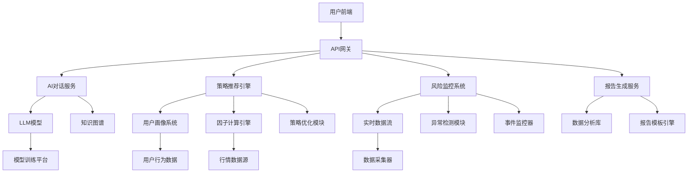
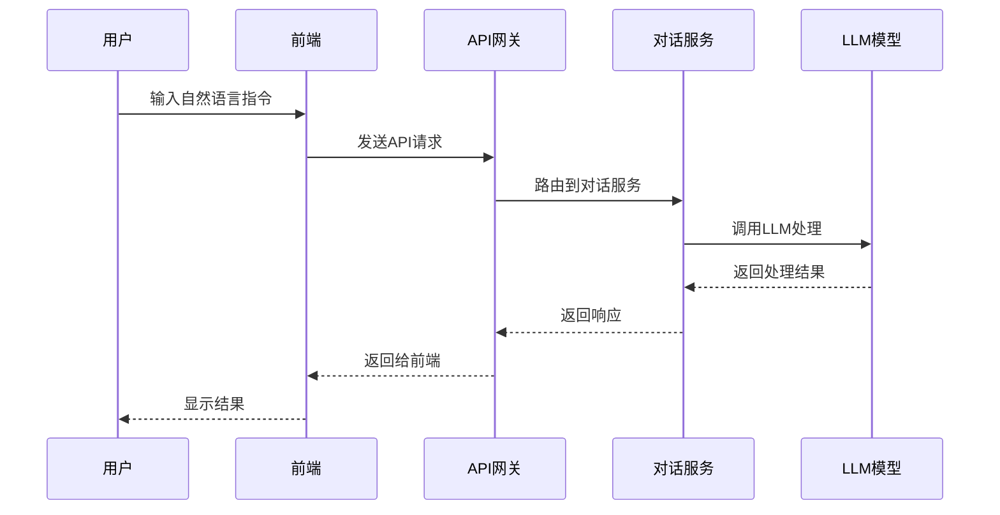
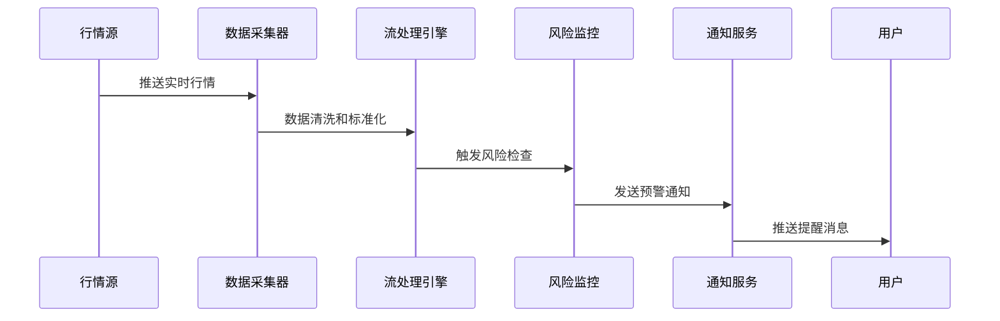

# AI 投资助手 - 详细功能与技术实现方案

## 1. 概述

AI 投资助手是本系统的核心智能化模块，旨在通过自然语言交互、个性化策略推荐、智能调仓建议等功能，为用户提供全方位的投资辅助。本文档将详细阐述各功能模块的具体实现方式、关键技术要点及潜在挑战。

## 2. 功能模块详解

### 2.1 AI 决策对话

#### 功能描述

用户可通过自然语言与 AI 助手进行交互，获取投资建议、策略分析、风险评估等信息。

#### 关键实现点

- **自然语言理解(NLU)**：使用大语言模型(LLM)解析用户意图，识别关键实体（如股票代码、时间范围、操作类型等）
- **对话状态管理**：维护多轮对话上下文，确保理解用户连续指令
- **投资领域知识图谱**：构建金融领域专业知识库，提高问答准确性和专业性

#### 技术实现思路

- 采用 LangChain 或类似框架构建对话流程
- 集成金融领域预训练模型（如 BloombergGPT）
- 设计专用 Prompt 工程优化投资相关问答效果

#### 潜在难点

- 如何准确理解复杂的金融术语和表达方式
- 多轮对话中的上下文维护和指代消解
- 平衡响应速度与准确性

### 2.2 个性化策略推荐

#### 功能描述

基于用户风险偏好、投资目标、历史行为与当前行情，生成个性化的股票池或策略建议。

#### 关键实现点

- **用户画像构建**：收集并分析用户风险承受能力、投资偏好、历史交易行为等数据
- **多因子选股模型**：整合基本面、技术面、市场情绪等多维度因子
- **动态策略生成**：根据不同市场环境自适应调整推荐策略

#### 技术实现思路

- 使用协同过滤或深度学习算法构建用户画像
- 集成量化分析库（如 Pandas、Scikit-learn）进行因子计算
- 采用强化学习或遗传算法优化策略组合

#### 潜在难点

- 如何平衡个性化与普适性，避免过度拟合
- 多因子模型的稳定性和可解释性
- 实时行情数据处理与策略更新效率

### 2.3 策略解释器

#### 功能描述

将复杂的策略逻辑用通俗易懂的自然语言进行解释，提高用户信任度。

#### 关键实现点

- **策略逻辑抽象**：将量化策略转换为可解释的规则集合
- **自然语言生成(NLG)**：将策略规则转化为用户友好的表述
- **可视化辅助**：结合图表直观展示策略原理和效果

#### 技术实现思路

- 开发策略标签系统，为每种策略类型定义标准解释模板
- 利用 LLM 进行个性化语言风格调整
- 集成数据可视化工具（如 Plotly、D3.js）增强解释效果

#### 潜在难点

- 如何在准确性和易懂性之间取得平衡
- 复杂策略的简化表达可能丢失重要信息
- 不同用户群体对解释详细程度的需求差异

### 2.4 复盘总结

#### 功能描述

每日或每周自动生成投资复盘报告，包括收益分析、风险评估、策略有效性评价及优化建议。

#### 关键实现点

- **自动化报告生成**：定时任务触发报告编制流程
- **多维度绩效分析**：涵盖收益率、风险指标、策略执行情况等
- **智能优化建议**：基于历史表现提出改进措施

#### 技术实现思路

- 使用定时任务框架（如 Celery）调度报告生成任务
- 集成统计分析库（如 NumPy、SciPy）计算各项指标
- 结合 LLM 自动生成结构化报告文本

#### 潜在难点

- 如何客观评价策略有效性，排除市场随机性影响
- 大量历史数据处理的性能优化
- 优化建议的实用性和可操作性

### 2.5 AI 调仓建议

#### 功能描述

实时监控市场动态和投资组合表现，提供智能调仓建议，支持自动 rebalancing 和 tax-loss
harvesting 功能。

#### 关键实现点

- **实时监控系统**：持续跟踪市场变化和组合状态
- **调仓触发机制**：设定合理的调仓条件和阈值
- **优化算法**：在控制风险的前提下最大化收益

#### 技术实现思路

- 使用消息队列（如 Kafka）实现实时数据流处理
- 开发基于现代投资组合理论(MPT)的优化算法
- 集成税务优化模块实现 tax-loss harvesting

#### 潜在难点

- 实时数据处理的延迟和准确性要求
- 调仓频率与交易成本之间的权衡
- 市场极端情况下的风控措施

### 2.6 投资组合分析

#### 功能描述

全面分析用户投资组合的风险指标、资产配置情况及与基准指数的对比分析。

#### 关键实现点

- **风险指标计算**：波动率、最大回撤、夏普比率等核心指标
- **资产配置分析**：行业分布、地域分布、市值分布等
- **基准对比**：与市场指数、同类基金等进行业绩比较

#### 技术实现思路

- 利用金融计算库（如 PyPortfolioOpt）进行风险分析
- 开发可视化面板展示各项分析结果
- 集成第三方基准数据源进行对比分析

#### 潜在难点

- 多种风险指标之间的协调和综合评价
- 基准选择的合理性和公平性
- 复杂投资组合的分解和归因分析

### 2.7 市场情绪洞察

#### 功能描述

利用 NLP 分析新闻、社交媒体和研报，提供市场情绪指标和潜在影响因素分析。

#### 关键实现点

- **数据采集**：从多种渠道获取新闻和社交媒体数据
- **情感分析**：判断市场参与者的情绪倾向（积极/消极/中性）
- **影响力评估**：识别对市场具有重大影响的事件和话题

#### 技术实现思路

- 使用网络爬虫技术获取公开数据源
- 应用预训练情感分析模型（如 BERT）进行文本分类
- 开发事件驱动分析模块识别关键影响因素

#### 潜在难点

- 数据质量和噪声处理
- 情感分析的准确性和时效性
- 将情绪指标有效整合到投资决策流程中

### 2.8 风险预警系统

#### 功能描述

当个股或投资组合出现异常波动、重大事件或风险指标超标时，主动推送风险预警通知。

#### 关键实现点

- **异常检测**：识别价格、成交量等指标的异常变动
- **事件监控**：跟踪公司公告、政策变化等重大事件
- **多级预警机制**：根据风险等级采取不同的提醒方式

#### 技术实现思路

- 使用统计学方法（如 Z-score）检测异常值
- 集成新闻监测服务获取重大事件信息
- 开发推送通知系统（邮件、短信、App内提醒等）

#### 潜在难点

- 异常检测算法的误报率和漏报率控制
- 重大事件的及时性和准确性
- 用户对频繁预警的接受度和响应效果

### 2.9 投资教育指导

#### 功能描述

根据用户的投资水平和兴趣，提供个性化的投资知识学习路径和实时答疑解惑。

#### 关键实现点

- **个性化学习路径**：根据用户基础和目标定制学习计划
- **互动式答疑**：解答用户在学习过程中遇到的问题
- **知识点推荐**：基于用户行为推荐相关内容

#### 技术实现思路

- 建立投资知识图谱，组织各类概念和技能点
- 使用推荐算法为用户匹配合适的学习内容
- 集成智能问答系统处理用户提问

#### 潜在难点

- 学习内容的质量控制和更新维护
- 用户学习进度和效果的跟踪评估
- 理论知识与实际操作的有效结合

## 3. 技术架构设计

### 3.1 整体架构

### 3.2 核心组件说明

#### 3.2.1 LLM模型服务

- 负责处理所有自然语言相关的任务
- 需要针对金融领域进行专门的微调和优化
- 支持多版本模型部署，便于A/B测试

#### 3.2.2 策略引擎

- 包含多种预定义策略模板
- 支持用户自定义策略的注册和执行
- 提供策略回测和优化接口

#### 3.2.3 实时数据处理

- 接收并处理来自各个数据源的实时行情
- 执行异常检测和风险评估计算
- 触发相应的预警和调仓建议

#### 3.2.4 用户画像系统

- 存储和更新用户的基本信息和行为数据
- 计算用户风险偏好和投资偏好标签
- 为个性化推荐提供数据支撑

## 4. 数据流设计

### 4.1 用户交互数据流

### 4.2 实时监控数据流

## 5. 性能与扩展性考虑

### 5.1 性能优化策略

1. **缓存机制**：
   - 对常用查询结果进行缓存（如热门股票信息、策略模板等）
   - 使用 Redis 等内存数据库提高访问速度

2. **异步处理**：
   - 对耗时操作（如报告生成、复杂计算）采用异步处理
   - 使用消息队列解耦各服务组件

3. **数据库优化**：
   - 对高频查询字段建立索引
   - 使用读写分离提高数据库性能

### 5.2 扩展性设计

1. **微服务架构**：
   - 各功能模块独立部署，便于横向扩展
   - 使用容器化技术（如 Docker）简化部署流程

2. **负载均衡**：
   - 在 API 网关层实现请求分发
   - 支持根据业务量动态调整服务实例数量

3. **模块化设计**：
   - 策略引擎支持插件化扩展
   - AI 模型支持热插拔替换

## 6. 安全与合规考虑

### 6.1 数据安全

1. **数据加密**：
   - 用户敏感信息在传输和存储过程中进行加密
   - 使用 HTTPS 协议保护 API 通信安全

2. **访问控制**：
   - 实现基于角色的访问控制(RBAC)
   - 对敏感操作进行二次验证

### 6.2 合规要求

1. **信息披露**：
   - 明确标注所有 AI 建议仅为参考，不构成投资建议
   - 提供风险提示和免责声明

2. **数据隐私**：
   - 遵守相关数据保护法规（如 GDPR）
   - 提供用户数据删除和导出功能

## 7. 项目实施路线图

### 7.1 第一阶段（MVP版本）

- 实现基础的 AI 对话功能
- 提供简单的策略推荐能力
- 开发基本的投资组合分析功能

### 7.2 第二阶段

- 完善个性化推荐算法
- 实现实时风险监控和预警
- 增强策略解释和可视化能力

### 7.3 第三阶段

- 开发智能调仓建议功能
- 实现市场情绪分析模块
- 完善投资教育指导系统

## 8. 风险评估与应对措施

### 8.1 技术风险

1. **模型准确性不足**：
   - 应对措施：持续优化模型训练数据和算法
   - 建立模型效果监控和反馈机制

2. **系统性能瓶颈**：
   - 应对措施：提前进行压力测试和性能优化
   - 设计可扩展的系统架构

### 8.2 业务风险

1. **用户依赖过度**：
   - 应对措施：明确免责声明，强调用户自主决策责任
   - 提供充分的风险教育内容

2. **监管政策变化**：
   - 应对措施：密切关注相关政策动态
   - 建立灵活的合规调整机制
