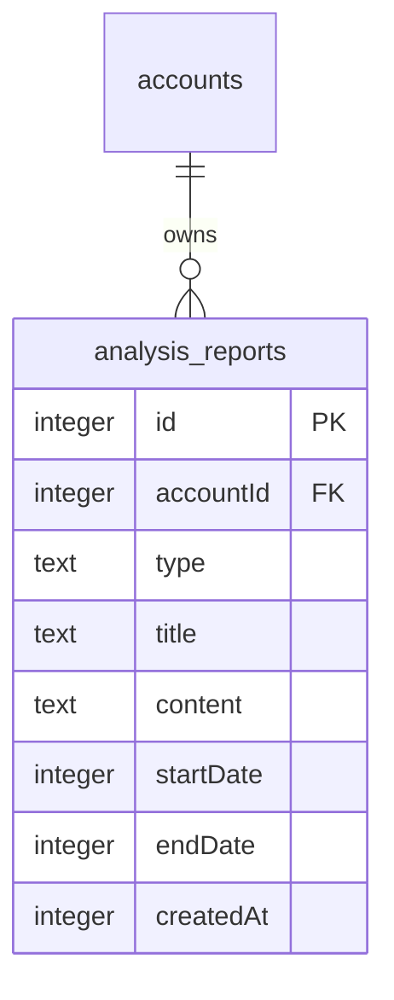
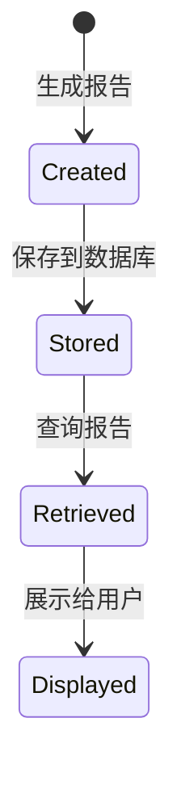

# Data Model for AI 智能投资周报

## 1. 核心实体

### 1.1 分析报告 (AnalysisReport)

这是周报功能的核心实体，用于存储生成的分析报告。

| 字段名 | 类型 | 约束 | 描述 |
|--------|------|------|------|
| id | integer | Primary Key, Auto Increment | 报告唯一标识符 |
| accountId | integer | Not Null, Foreign Key (accounts.id) | 关联的账户ID |
| type | text | Not Null, Default: 'weekly' | 报告类型 (weekly, monthly, emergency) |
| title | text | Not Null | 报告标题 |
| content | text | Not Null | 报告内容 (Markdown格式) |
| startDate | integer (timestamp) | Nullable | 报告周期开始时间 |
| endDate | integer (timestamp) | Nullable | 报告周期结束时间 |
| createdAt | integer (timestamp) | Not Null | 报告创建时间 |

### 1.2 周报数据聚合 (WeeklyReportData)

这是一个虚拟实体，用于表示在生成周报时需要聚合的数据。

| 字段名 | 类型 | 描述 |
|--------|------|------|
| performance | WeeklyPerformance | 本周业绩数据 |
| transactions | TransactionRecordType[] | 本周交易记录 |
| marketEvents | AssetMarketInfoType[] | 本周市场事件 |
| notes | NoteType[] | 本周用户笔记 |
| positionChanges | PositionChange[] | 持仓变化数据 |
| investmentMemos | AssetMetaType[] | 核心持仓的投资备忘录 |

### 1.3 本周业绩 (WeeklyPerformance)

| 字段名 | 类型 | 描述 |
|--------|------|------|
| totalValue | number | 总资产净值 |
| previousValue | number | 上周总资产净值 |
| changeAmount | number | 净值变化金额 |
| changePercentage | number | 净值变化百分比 |
| benchmarkPerformance | number | 基准表现 (如标普500/沪深300) |
| maxDrawdown | number | 最大回撤 |
| sharpeRatio | number | 夏普比率 |

### 1.4 持仓变化 (PositionChange)

| 字段名 | 类型 | 描述 |
|--------|------|------|
| symbol | string | 资产代码 |
| previousQuantity | number | 上周持仓数量 |
| currentQuantity | number | 当前持仓数量 |
| changeQuantity | number | 持仓变化数量 |
| averageCost | number | 平均成本 |
| currentPrice | number | 当前价格 |
| changePercentage | number | 涨跌幅 |
| contribution | number | 对整体收益的贡献 |

## 2. 实体关系图



## 3. 验证规则

### 3.1 AnalysisReport 验证规则

1. **accountId** 必须引用存在的账户
2. **type** 必须是预定义的枚举值之一 ('weekly', 'monthly', 'emergency')
3. **title** 不能为空且长度不超过255字符
4. **content** 不能为空
5. **startDate** 和 **endDate** 必须是有效的日期时间戳
6. **endDate** 必须大于或等于 **startDate**
7. **createdAt** 必须是有效的日期时间戳

### 3.2 WeeklyReportData 验证规则

1. **performance** 对象必须包含所有必需字段
2. **transactions** 数组中的每个交易记录必须符合 TransactionRecordType 规范
3. **marketEvents** 数组中的每个市场事件必须符合 AssetMarketInfoType 规范
4. **notes** 数组中的每个笔记必须符合 NoteType 规范
5. **positionChanges** 数组中的每个持仓变化必须符合 PositionChange 规范
6. **investmentMemos** 数组中的每个投资备忘录必须符合 AssetMetaType 规范

## 4. 状态转换

AnalysisReport 实体的状态转换相对简单，主要是创建和查询：



## 5. 索引策略

为了优化查询性能，建议在以下字段上创建索引：

1. **accountId** - 用于按账户查询报告
2. **type** - 用于按报告类型查询
3. **createdAt** - 用于按时间排序和范围查询
4. **startDate, endDate** - 用于按时间范围查询

复合索引建议：
- (accountId, type, createdAt) - 用于按账户和类型查询最新报告
- (accountId, startDate, endDate) - 用于按账户和时间范围查询报告

## 6. 数据库 Schema 扩展

基于现有数据库 schema，需要添加新的表：

```typescript
// 分析报告表
export const analysisReports = sqliteTable('analysis_reports', {
  id: integer('id').primaryKey({ autoIncrement: true }),
  accountId: integer('account_id')
    .notNull()
    .references(() => accounts.id),
  type: text('type').notNull().default('weekly'), // weekly, monthly, emergency
  title: text('title').notNull(),
  content: text('content').notNull(), // Markdown 内容
  startDate: integer('start_date', { mode: 'timestamp' }),
  endDate: integer('end_date', { mode: 'timestamp' }),
  createdAt: integer('created_at', { mode: 'timestamp' }).notNull(),
});
```

## 7. API 数据结构

### 7.1 获取报告列表响应

```typescript
interface ReportListItem {
  id: string;
  title: string;
  type: 'weekly' | 'monthly' | 'emergency';
  startDate: Date;
  endDate: Date;
  createdAt: Date;
}
```

### 7.2 获取报告详情响应

```typescript
interface ReportDetail {
  id: string;
  accountId: string;
  type: 'weekly' | 'monthly' | 'emergency';
  title: string;
  content: string; // Markdown 格式
  startDate: Date;
  endDate: Date;
  createdAt: Date;
}
```

### 7.3 生成报告请求

```typescript
interface GenerateReportRequest {
  accountId: string;
  type: 'weekly' | 'monthly';
  startDate?: Date;
  endDate?: Date;
}
```

### 7.4 生成报告响应

```typescript
interface GenerateReportResponse {
  id: string;
  status: 'pending' | 'processing' | 'completed' | 'failed';
  message?: string;
}